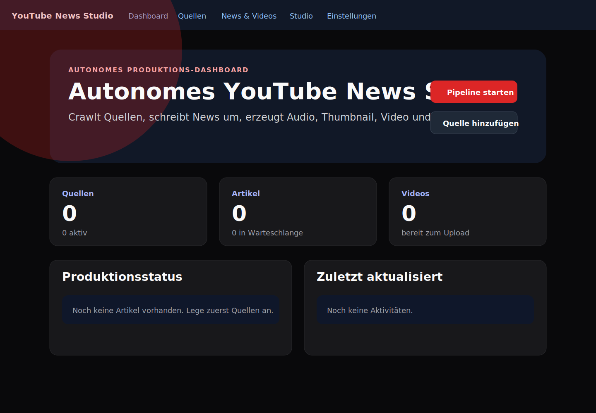
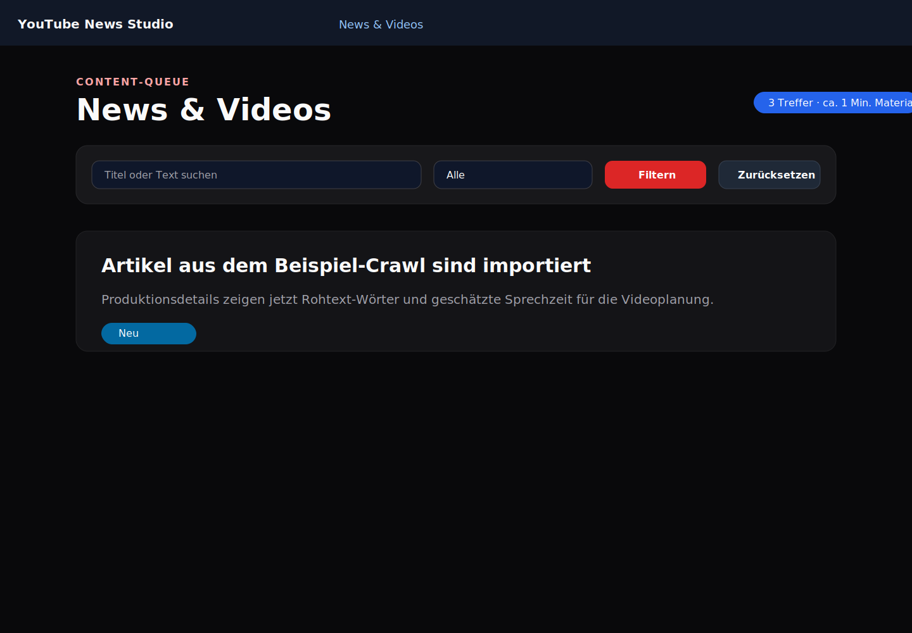
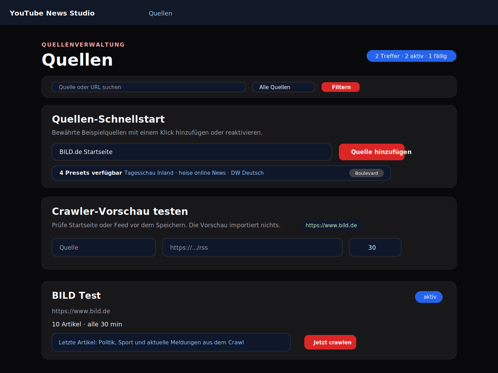
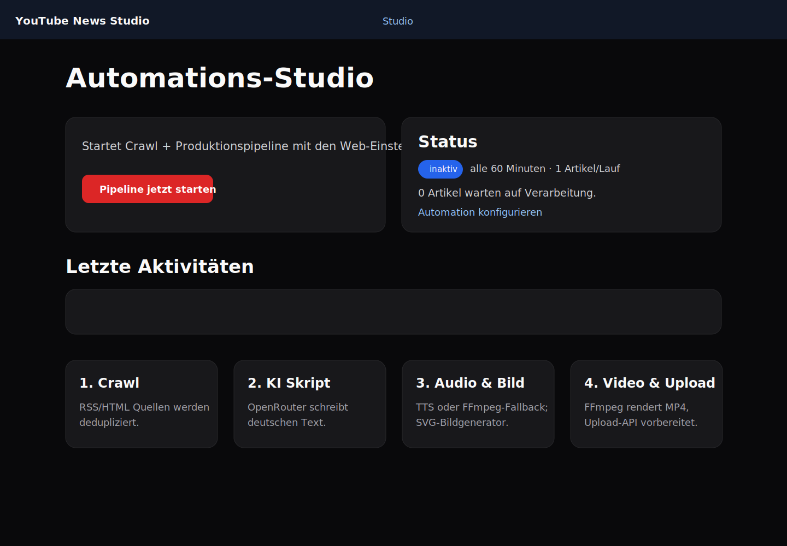
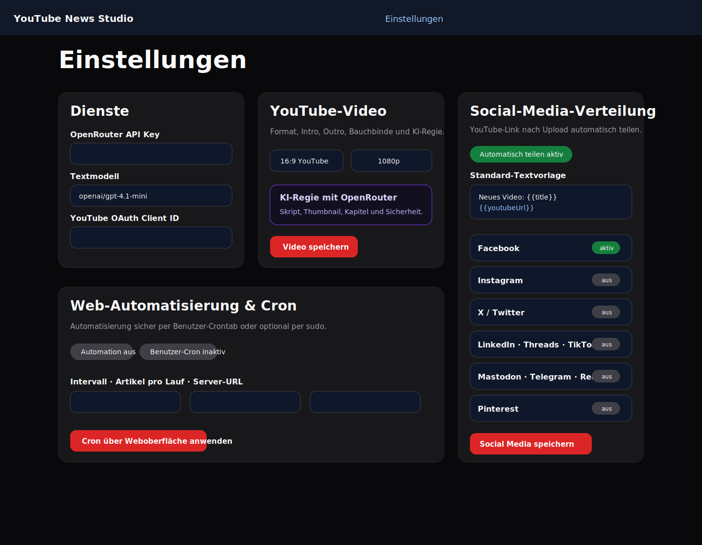

# YouTube News Company OS

Eine Next.js-16-Redaktions- und Markenplattform, in der der Benutzer als CEO ein virtuelles KI-Team führt. YouTube ist der zentrale Videokanal, Twitch der Live-Kanal, das eigene Webmagazin das dauerhafte Archiv und Social Media die Distribution.

## Company OS

- CEO-Cockpit mit Kennzahlen für News-Pipeline, Produktion, Redaktionsaufträge, KI-Budget und Kanäle
- Virtuelles Redaktionsteam aus Chefredaktion, Newsdesk, Recherche, Video-Autor, Social/Growth und Standards/Fakten
- Persistenter Mitarbeiter-Chat über OpenRouter mit lokaler, kostenfreier Fallback-Logik
- KI-generiertes Kanban-Board, Redaktionskalender und kanalübergreifende Kampagnenplanung
- Eigenes öffentliches Webmagazin mit KI-erstellten, eigenständigen Fassungen und transparenter Quellenverlinkung
- Twitch OAuth Authorization Code Flow, automatische Token-Erneuerung, Kanalstatus, Titel/Kategorie/Tags und Live-Highlight-Marker
- YouTube OAuth, Video-Pipeline und Social Distribution aus einer gemeinsamen Oberfläche

## OpenRouter-Modellrouting und Kostenkontrolle

Nicht jede Aufgabe läuft über ein teures Universalmodell. Die zentrale Routing-Schicht ordnet jeder Anfrage ein Szenario, Tokenlimit und Kostenbudget zu. Die Standardwerte sind ein Preis-Snapshot der offiziellen OpenRouter Models API vom 2026-07-01 und können unter **Einstellungen → Dienste → OpenRouter** überschrieben werden:

| Aufgabe | Standardmodell | Warum |
| --- | --- | --- |
| Triage | `qwen/qwen3-30b-a3b-instruct-2507` | sehr günstige Klassifikation und Priorisierung |
| Social | `mistralai/ministral-8b-2512` | kurze Plattformtexte mit niedrigem Outputpreis |
| Skript/Web | `deepseek/deepseek-v3.2` | gutes Preis-Leistungs-Verhältnis für längere Entwürfe |
| Recherche | `google/gemini-2.5-flash-lite` | großer Kontext bei niedrigen Kosten |
| Strategie | `openai/gpt-4.1-mini` | nur für Planungs- und Leitungsaufgaben |
| Fakten/Risiko | `anthropic/claude-haiku-4.5` | gezielt für sensible Qualitätsprüfung |

Monatsbudget, Einzellimit und CEO-Freigabeschwelle werden vor jeder Anfrage geprüft. Tatsächliche Token und Kosten werden aus der OpenRouter-Antwort in SQLite protokolliert. Bei fehlendem API-Key, Budgetstopp oder API-Ausfall bleiben Redaktion, Planung, Webpublikation und Medienproduktion durch deterministische lokale Fallbacks bedienbar.

Technische Referenzen: [OpenRouter API](https://openrouter.ai/docs/api/reference/overview), [OpenRouter Models API](https://openrouter.ai/api/v1/models), [Twitch Authentication](https://dev.twitch.tv/docs/authentication/), [Twitch Helix API](https://dev.twitch.tv/docs/api/reference/).

## Bestehende Produktionsfunktionen

- Quellenverwaltung für RSS-Feeds und HTML-Seiten inkl. Schnellstart-Presets, verbesserter Artikel-Erkennung über JSON-LD, typische News-Links und lesbare Crawl-Vorschau
- Regelmäßiger Crawl per API oder `npm run worker`
- OpenRouter-Integration für umformulierte deutsche Sprechertexte
- ElevenLabs TTS plus lokaler FFmpeg-Fallback ohne externe API
- Bild-/Thumbnail-Generierung als scriptbare SVG-Dateien
- FFmpeg-Rendering zu MP4 mit konfigurierbaren Formaten, Intros, Outros und Bauchbinden
- Einstellungsseite für OpenRouter, ElevenLabs, YouTube-OAuth, detaillierte Video-Presets und Social-Media-Verteilung
- YouTube-Upload-Endpunkt als sauberer Integrationspunkt für Google OAuth/YouTube Data API
- Automatische Verteilung vorbereiteter YouTube-Links an Facebook, Instagram, X/Twitter, LinkedIn, Threads, TikTok, Mastodon, Telegram, Reddit und Pinterest

## Start

```bash
npm install
npm run dev
```

Öffne http://localhost:3000.

## Screenshots der Weboberfläche

Die folgenden Ansichten zeigen die Weboberfläche nach dem Start mit `npm run dev`. Die Screenshots liegen als versionierbare SVG-Dateien im Repository, damit keine Binärdateien eingecheckt werden müssen.

### Dashboard



### News & Videos



### Quellenverwaltung



### Automations-Studio



### Einstellungen, Social Media & Cron



## Automatisierung

```bash
npm run worker
```

Crawler gezielt mit einer Quelle testen, z. B. BILD.de:

```bash
npm run test:crawl -- https://www.bild.de "BILD Test"
```

Oder per Cron/Webhook:

```bash
curl -X POST http://localhost:3000/api/workflow/run \
  -H 'content-type: application/json' \
  -d '{"crawl":true}'
```


### Crawler-Vorschau und Beispieltest

Die Quellenverwaltung enthält jetzt eine **Crawler-Vorschau testen**-Box und einen **Quellen-Schnellstart** mit vorkonfigurierten Beispielquellen wie BILD.de, Tagesschau, heise und DW. Damit kann eine RSS- oder HTML-URL vor dem Speichern geprüft werden; die Vorschau zeigt erkannte Artikelkandidaten, importiert aber noch nichts. In der Artikel-Queue wird zusätzlich die geschätzte Sprechzeit des aktuell gefilterten Materials angezeigt.

Getestete Crawl-Kommandos:

```bash
npm run test:crawl -- https://www.bild.de "BILD Test"
```

In dieser Ausführungsumgebung war der externe Zugriff auf BILD.de am 2026-07-01 per `ENETUNREACH` blockiert. Deshalb wurde derselbe Crawler zusätzlich mit einem lokalen `data:text/html`-Beispiel getestet. Der lokale Test importierte zwei Beispielartikel in die SQLite-Datenbank und validierte, dass Artikel vorhanden sind. Der HTML-Crawler priorisiert nun außerdem Headline-Test-IDs, Headline-Klassen, Bild-Alt-Texte, Regional-/Ratgeber-Ressorts und sortiert Kandidaten nach Artikelscore, damit Startseiten wie BILD.de zuverlässiger verwertbare Meldungen liefern.

## Social-Media-Verteilung nach YouTube-Upload

Unter **Einstellungen → Social-Media-Verteilung** können mindestens zehn bekannte Kanäle aktiviert werden: Facebook, Instagram, X/Twitter, LinkedIn, Threads, TikTok, Mastodon, Telegram, Reddit und Pinterest. Pro Kanal lassen sich Aktivierung, Webhook/API-Endpunkt, Access Token, Ziel-ID und eine eigene Textvorlage speichern. Nach einem YouTube-Upload bzw. der aktuellen Upload-Vorbereitung wird der YouTube-Link mit Text automatisch verteilt. Ist für einen Kanal noch kein echter API-Endpunkt hinterlegt, protokolliert die App den Post als vorbereitet, sodass die Automatisierung gefahrlos getestet werden kann.

Unterstützte Template-Variablen sind `{{title}}`, `{{summary}}`, `{{sourceUrl}}`, `{{youtubeUrl}}` und `{{channel}}`. Die Artikelansicht zeigt in den Produktionsdetails die letzten Social-Post-Status pro Artikel.

## Hinweise

Binärdateien werden nicht eingecheckt. Audio-/Video-Artefakte entstehen zur Laufzeit unter `public/generated/` und sind per `.gitignore` ausgeschlossen. Die README-Screenshots sind deshalb bewusst als SVG-Dateien abgelegt.

## Web-Automatisierung & Cron

Die Automatisierung kann nach dem Start der App vollständig in der Weboberfläche unter **Einstellungen → Web-Automatisierung & Cron** konfiguriert werden:

- Intervall, Crawl-Verhalten, Server-URL und Artikelanzahl pro Lauf
- Installation oder Entfernung eines Benutzer-Crontabs
- Optional Installation als Root-Crontab per sudo; das Root-Passwort wird nur für diesen Vorgang verwendet und nicht gespeichert

Der Cron ruft intern weiterhin den Workflow-Endpunkt `/api/workflow/run` auf. Für mehrere Videos pro Lauf kann `maxArticles` im JSON-Payload gesetzt werden.

### Bedienkomfort in der Oberfläche

Die Einstellungsseite zeigt zusätzlich einen Live-Status für Benutzer- und Root-Crontab, den ausführenden Server-Benutzer, die sudo-Verfügbarkeit, den geplanten Cron-Befehl und den nächsten erwarteten Lauf. Derselbe Status ist maschinenlesbar über `GET /api/automation/cron` verfügbar; Änderungen und Cron-Installationen können weiterhin per `POST /api/automation/cron` ausgeführt werden.


## Video-Presets

Unter **Einstellungen → YouTube-Video Produktion** kann das Ausgabevideo ohne Codeänderung gesteuert werden:

- Seitenverhältnis 16:9, 9:16 oder 1:1 sowie 720p/1080p
- automatisch erzeugtes Intro und Outro per SVG/FFmpeg oder eigene Assets aus `public/`
- Farben, Bauchbinde, Thumbnail-Stil und Call-to-Action für das KI-Skript
- YouTube-Titel-, Beschreibungs-, Tags-, Sprache- und Sichtbarkeitsvorlagen

Alle automatisch erzeugten Medien bleiben Laufzeit-Artefakte unter `public/generated/`; es werden keine Binärdateien eingecheckt.

## Verbesserter Crawler

Der Crawler versucht zuerst RSS/Atom zu lesen. Für den Schnellstart bringt die App Presets für BILD.de, Tagesschau Inland, heise online und DW Deutsch mit, die direkt in der Quellenverwaltung hinzugefügt oder reaktiviert werden können. Wenn eine Quelle nur eine HTML-Startseite anbietet, sucht er zusätzlich nach strukturierten `NewsArticle`-/`Article`-Daten in JSON-LD und nach typischen Nachrichtenlinks in Bereichen wie `article`, `main` und Überschriften. In der Quellenverwaltung erscheinen pro Quelle die zuletzt gefundenen Artikel direkt in der Karte, damit Crawl-Ergebnisse ohne Wechsel in die Queue kontrolliert werden können.
